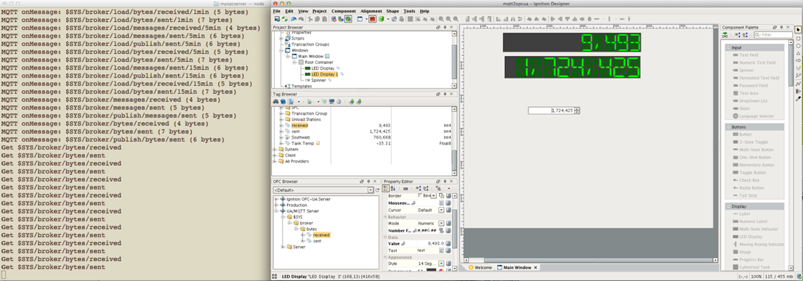

<b> Bi Directional MQTT to OPCUA Bridge </b>

Expose MQTT topics to an OPCUA server via folders. Supports read/write. 

Usage:

- git clone https://github.com/nzfarmer1/mqtt2opcua
- cd mqtt2opcua
- npm link (view/edit examples/run.js)
- node examples/run.js

node creates an OPC server that:

1. Connects to an MQTT broker
2. Subscribes to '#' or a predefined set of topics
3. On 1st Message of an unseen topic it creates the folder paths and node (last part of path) with nodeId  s=topic
4. On all onMessage calls, it keeps track of the topic's payload
5. On Set requests it publishes the raw value from the OPCUA client
6. On Get requests it returns the formatted persistant payload

Note:

Recently upgraded to support MQTT auth and to remove spaces from OPCUA name in example

PLEASE REMEMBER TO CHECK FOR UPDATES REGULARLY!

Todo: Add authentication

For configuration options and formatting of payloads, see handlers example below.

<pre>

var  mqtt2opc = require("../mqtt2opcua").run;
var  Events = require('events').EventEmitter;

forward = new Events();
backward = new Events();

// Set up forward and reverse data conversion functions
// These are based on topic path - the finer grained pattern will be used.
// Examples below

forward.on("$SYS/broker/bytes/#", function(payload) {
    return {
            dataType: "Int32",
            value: parseInt(payload)
         }
});

backward.on("$SYS/broker/bytes/#", function(variant) {
            return {
                topic:variant.topic,
                payload:variant.value
            };
});

options = {
    opcHost:"localhost",
    opcPort:"4334",
    mqttHost:"localhost",
    mqttPort:"1883",
    debug:true,
    roundtrip:false,    // Set to true if you wish to enforce the integrity of round trip communications	
    forward:forward,	// data converter - mqtt -> opcua
    backward:backward,	// data converter - opcua -> mqtt
    //topics:['#','$SYS/#'] // Customize to override. These are the default so uncessary.
};

var server = new mqtt2opc(options);

</pre>

Please feel free to fork and improve.

<i>
Andrew McClure, Director <a href="http://agsense.co.nz">AgSense</a> -  Bringing I.o.T to NZ Agriculture
</i>

<b><a href="https://payment.swipehq.com/?product_id=EB82DA1340C7E">Koha (Donation)</a> - If you like our work and would like to make a small donation to help us continue</b>
